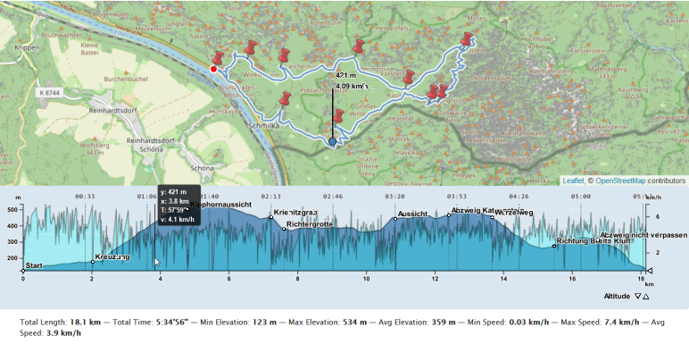
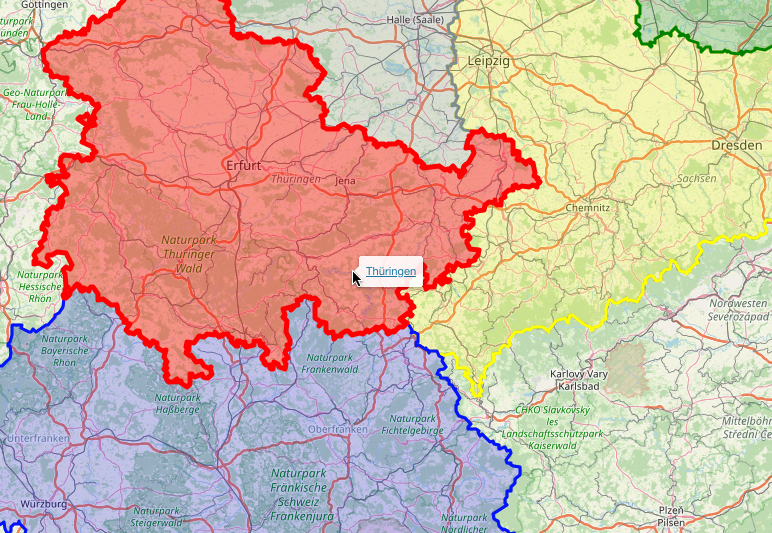
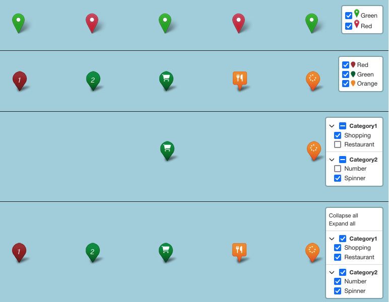
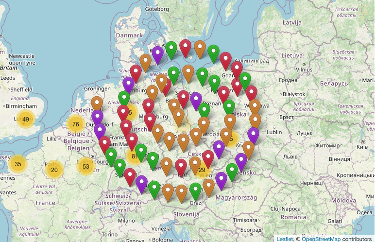
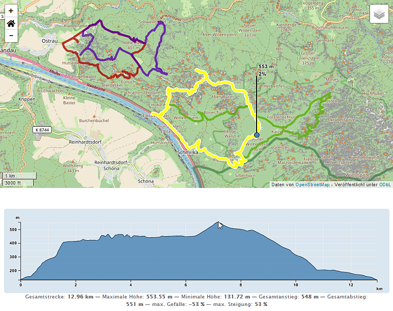
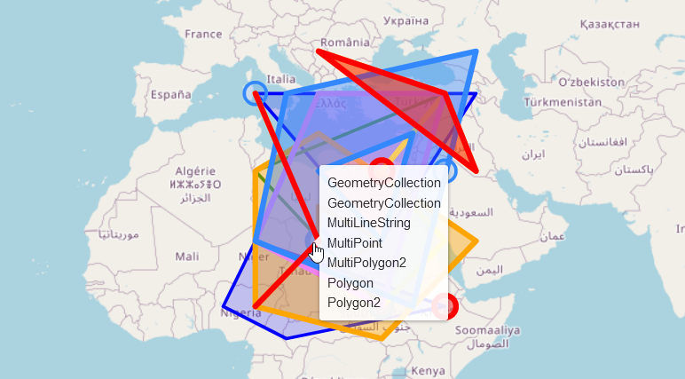

<a href="https://wordpress.org/plugins/extensions-leaflet-map/">Official WordPress Plugin</a>

# Extensions for Leaflet Map Github Version

Stable tag: 2.2.6   
Requires at least: 5.5.3  
Tested up to: 5.9  
License: GPLv2 or later  
Tags: leaflet, gpx, elevation, markercluster, zoomhome, hover, fullscreen  
Contributors: hupe13  

## Description

Extends the WordPress Plugin <a href="https://wordpress.org/plugins/leaflet-map/">Leaflet Map</a> with Leaflet Plugins and other functions.

### Used Leaflet Plugins and Elements

*   [leaflet-elevation](https://github.com/Raruto/leaflet-elevation), [Leaflet.EasyButton](https://github.com/CliffCloud/Leaflet.EasyButton): Track with Elevation Profile
*   [leaflet-gpxgroup](https://github.com/Raruto/leaflet-elevation/blob/master/libs/leaflet-gpxgroup.js), [Leaflet.GeometryUtil](https://github.com/makinacorpus/Leaflet.GeometryUtil): Multiple tracks with elevation profiles on one map
*   [L.control.layers](https://leafletjs.com/examples/layers-control/): Switching Tilelayers
*   [Leaflet-providers](https://github.com/leaflet-extras/leaflet-providers): An extension that contains configurations for various tile providers.
*   [Leaflet.Control.Opacity](https://github.com/dayjournal/Leaflet.Control.Opacity): makes multiple tile layers transparent.
*   [Leaflet.markercluster](https://github.com/Leaflet/Leaflet.markercluster): Marker Cluster
*   [Leaflet.FeatureGroup.SubGroup](https://github.com/ghybs/Leaflet.FeatureGroup.SubGroup): add/remove groups of markers from Marker Cluster.
*   [Leaflet.MarkerCluster.PlacementStrategies](https://github.com/adammertel/Leaflet.MarkerCluster.PlacementStrategies): implements new possibilities how to place clustered children markers
*   [leaflet.zoomhome](https://github.com/torfsen/leaflet.zoomhome): Reset the view
*   [leaflet.fullscreen](https://github.com/brunob/leaflet.fullscreen): Fullscreen mode
*   [Leaflet.GestureHandling](https://github.com/Raruto/leaflet-gesture-handling): Gesture Handling

### Other functions

*   hover: Use it to highlight a gpx, kml or geojson element or get a tooltip on mouse over.
*   Hide Markers: Use it when a track in a GPX file contains some markers and you don't want to display them on the map.
*   Option to migrate from [WP GPX Maps](https://wordpress.org/plugins/wp-gpx-maps/) to elevation

## Screenshots

1. Track with elevation and other profiles and Switching Tile Layers 
1. Track with elevation profile only and Switching Tile Layers 
2. Multiple Tracks with elevation profile 
3. Hover a Geojson area  
4. Markercluster and Groups  
5. Markercluster PlacementStrategies  
6. GestureHandling  

## Documentation

Detailed documentation and examples in <a href="https://leafext.de/">German</a> and <a href="https://leafext.de/en/">English</a>.

## Installation

* First you need to install and configure the plugin <a href="https://wordpress.org/plugins/leaflet-map/">Leaflet Map</a>.
* Then install this plugin.
* Go to Settings - Leaflet Map - Extensions for Leaflet Map and get documentation and settings options.

## Changelog

### 2.2.5 / 220xxx

* hover.php reviewed, new: hovering circles, polygons and lines
* zoomhome.php max_zoom removed. This should be set in leaflet-map settings depending on the tiles.
  See https://github.com/leaflet-extras/leaflet-providers/blob/master/leaflet-providers.js
* clustergroup.php (Leaflet.FeatureGroup.SubGroup): markers can also be defined in a geojson file,
  new parameters others and unknown

### 2.2.5 / 220226

* leaflet-elevation 1.7.6
* elevation: new/changed options: waypoints, wptLabels, wptIcons
* fixed error in collapse control top right

### 2.2.4 / 220202

* WordPress 5.9
* fixed layerswitch
* fixed gestures (sgpx did not work because of this)
* cluster now works with leaflet-marker and markers in leaflet-gpx, leaflet-geojson, leaflet-kml
* multielavation: it works with multiple maps on one page now.
* hover: new option for click tolerance

### 2.2.3 / 220118

* leaflet-elevation 1.7.5
* elevation:
    * miles marker
    * in Safari: setting preferCanvas to false as default
* layerswitch:
    * extra options
    * Leaflet-providers
    * Leaflet.Control.Opacity
* some changes in leaflet-gestures.js for L.control

### 2.2.2 / 211228
* gestures: The language can be determined by Site or by Browser
* multielevation revised:
   * bug fix start marker
   * geojson filter for waypoints
   * option for filename as trackname
   * options like in elevation
   * Leaflet.GeometryUtil
* hidemarkers: geojson filter for marker
* leaflet.fullscreen 2.2.0

### 2.2.1 / 211111
* leaflet-elevation 1.7.3
* multielevation fixed, removed leaflet-gpx
* multielevation parameter name, lat, lng now optional
* zoomhomemap reviewed

### 2.2 / 211031
* Integration shortcode sgpx from WordPress plugin wp-gpx-maps (some parameters)
* leaflet.markercluster 1.5.3
* leaflet.fullscreen 2.1.0
* leaflet-elevation 1.7.2

### 2.1.3 / 211016
* bug fix in parameters for markercluster
* new parameter for elevation: show / hide chart and summary block as whole
* revision of the elevation admin page

### 2.1.2 / 210922
* Leaflet.markercluster V 1.5.1
* leaflet-gpx V 1.7.0
* leaflet-elevation V 1.7.0; new parameter waypoints
* taking care of parameter max_zoom from leaflet-map
* changing the parameter names for [cluster] to those of the Leaflet.markercluster (old names are still valid)
* [cluster] parameters are valid for [markerClusterGroup] also
* bug in [gestures] fixed
* bug in [layerswitch] option attribution fixed
* [zoomhomemap] works for any [leaflet-*] object. [elevation] no longer needs a marker for [zoomhomemap].
* ignore waypoints in gpxgroup (multielevation)
* and more

### 2.1.1 / 210824
* Bugs in placementstrategies and cluster

### 2.1 / 210823
* Leaflet.MarkerCluster.PlacementStrategies

### 2.0.2 - 2.0.3 / 210816
* Bugfix https://wordpress.org/support/topic/leafext_enqueue_elevation-unknown/
* New elevation parameter: marker

### 2.0.1 / 210722
* Works with Elementor now

### 2.0 / 210715
* Tested on WordPress 5.8
* enhancement of elevation and introduction of many parameters
* leaflet-gesture-handling 1.3.5
* leaflet-elevation-1.6.9
* bug fix hover

### 1.5 / 210620
* leaflet-elevation 1.6.8
* https://github.com/Raruto/leaflet-gesture-handling (is newer)
* fixed some mistakes in gestures and others
* deal with safari bug on markers popup
* hovering on all geojsons and markers
* multielevation (gpx-groups)

### 1.4 / 210521
* zoomhomemap works on multiple maps on a page now.
* fixing markercluster and markerClusterGroup for this.

### 1.3 / 210513
* Shortcodes can be used on more than one map per page, except zoomhomemap.
* Parameter for GestureHandling
* fixed markerClusterGroup
* prepare for translation
* documentation

### 1.2 / 210502
* documentation on a help page
* prepare for translation
* new setting options for [markercluster]
* new setting options for [zoomhomemap]

### 1.1 / 210417
* New functions:
* markerClusterGroup
* Switching Tile Layers

### 1.0.1 / 210409
* leaflet-elevation v1.6.7

### 1.0 / 210323
* First Release
